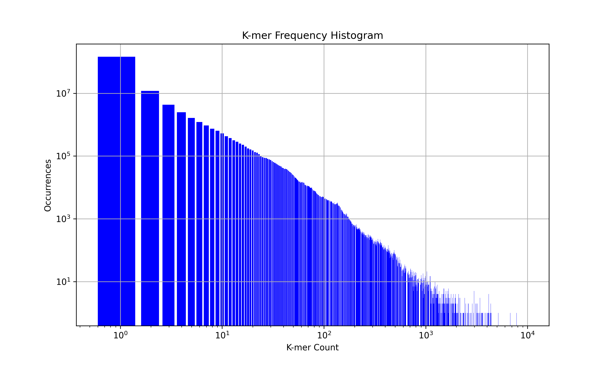

The goal is to check the k-mer count for the transcriptomes. The Jellyfish software will be used to count the k-mers. This software is available on SAGA. The following command will be used to perform the k-mer count:

```bash
module load Jellyfish/2.3.0-GCC-11.3.0  
GENOME=Haptolina_ericina_var_UIO028.mainGenome.softmasked.fasta
# jellyfish count -m <kmer_size> -s <hash_size> -t <num_threads> -C -o <output_file> <input_fasta_file>
jellyfish count -m 21 -s 100M -t 4 -C -o $GENOME.jf $GENOME
jellyfish histo -o kmer_histogram.txt $GENOME.jf

``` 
-m 21 sets the k-mer size to 21. This is a common choice for k-mer size, but you might want to adjust it depending on your specific needs.
-s 100M sets the hash size to 100 million. This should be sufficient for most purposes, but you might need to increase it if you're working with a very large genome.
-t 4 sets the number of threads to 4. Adjust this according to how many CPU cores are available on your machine.
-C tells Jellyfish to count both the k-mer and its reverse complement as the same k-mer.
-o output.jf specifies the output file.
input.fasta is the input FASTA file. Replace this with the path to your actual input file.

**The result is not conclusive, for a more reliable result the sequencing data is probably needed**


